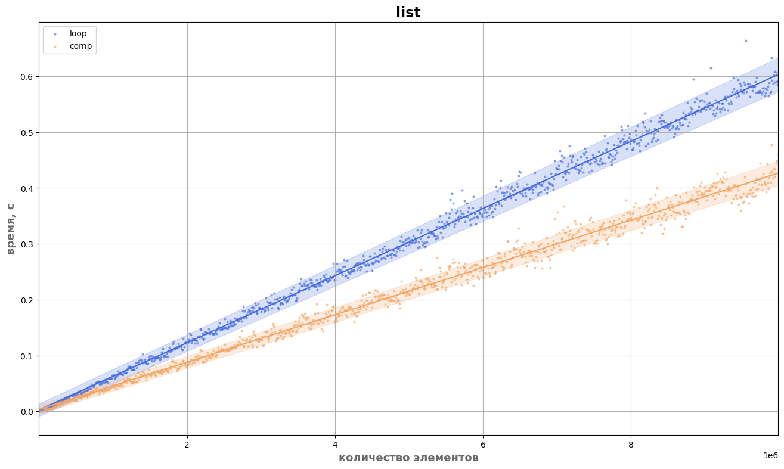
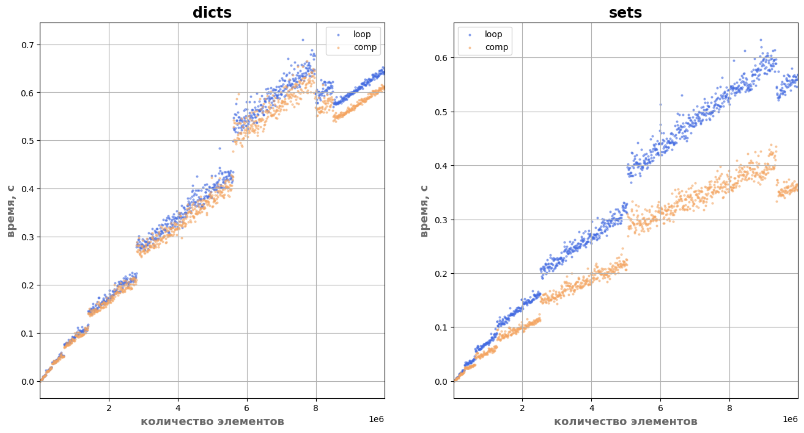

# Почему включения быстрее циклов?

Если вы пишите на Python и знакомы с различными включениями, вы наверняка слышали о том, что создание коллекции с помощью включения обычно работает быстрее, чем создание той же коллекции с помощью обычного цикла `for`. Я пишу на Python несколько лет, и разумеется я тоже слышал о производительности включений. Все время для меня этот факт был своего рода аксиомой, истиной, которая не требует проверки. Однако это неправильный подход к изучению точных наук и технологий, поэтому я сел разбираться.

## Быстродействие

Первое, с чего я решил начать - это понять, действительно ли при создании коллекций различного рода включения работают быстрее создания коллекций с помощью циклов и прямого использования метода вставки. Для решения этой задачи необходимо было собрать данные о времени работы обоих подходов, по возможности построить некоторые зависимости и осуществить визуальное сравнение полученных зависимостей. Разумеется я начал со сбора данных.

Для сбора времен работы подходов была использована следующая методика:
- Были рассмотрены следующие коллекции: `list`, `dict`, `set`;
- Измерялись времена создания коллекций размером от $10$ элементов до $10^7$ элементов с шагом в $1000$ элементов. Такие значения были выбраны, чтобы достичь компромисса между числом элементов, общим временем сбора данных и требуемым количеством памяти;
- Для каждого размера коллекции из указанного диапазона осуществлялось измерение времени создания коллекции с данным числом элементов с помощью цикла и нативного метода вставки, а также с помощью соответствующего включения;
- Время создания измерялось для каждого способа отдельно с помощью встроенной в Python библиотеки `time`;
- Все измерения помещались в специальную структуру;
- После рассмотрения всех значений размеров коллекций из обозначенного выше диапазона, полученные измерения сохранялись в файлы в формате json.

Для сбора времен я реализовал несколько вспомогательных функций, которые могут быть запущены одновременно в три процесса, чтобы ускорить аккумулирование данных. Стоит оговориться, что сбор времени работы сопряжен с аппаратной зависимостью, а также зависимостью от используемой версии интерпретатора. Я был ограничен следующими аппаратными и программными зависимостями:

- **OS**: `Windows 11`;
- **CPU**: `AMD Ryzen 7 5000U`
- **Оперативная память**: `16 ГБ`
- **Python**: `3.11.1`

На следующем этапе я визуализировал результаты и попытался оценить возможность построения некоторых зависимостей. В случае со списками удалось построить линейную зависимость времени создания от количества элементов по методу наименьших квадратов. Также удалось рассчитать коридор ошибок, в который поместилась значительная часть экспериментальных отсчетов.



В случае со словарями и множествами графики получились сильно разрывными, поэтому я не стал заморачиваться с построением тренда для них. Сами по себе графики для множеств и словарей структурно похожи между собой, что объясняется схожестью этих коллекций в плане реализации.



В результате действительно получилось, что создание коллекций с помощью включений работает быстрее создания коллекций с помощью циклов и нативных методов вставки.

## Причина

Итак, когда на вопрос, какой способ быстрее, был получен однозначный ответ - способ с включениями, передо мной встал вопрос о генезисе процесса. Почему включения работают быстрее? Ведь на первый взгляд включения - это всего лишь синтаксический сахар.

Чтобы ответить на этот вопрос я воспользовался модулем стандартной библиотеки [`dis`](https://docs.python.org/3.11/library/dis.html). С помощью этого модуля можно осуществить дизассемблирование байткода Python и проанализировать фактическую последовательность действий, которую осуществляет интепретатор для исполнения того или иного фрагмента кода. Сразу оговорюсь, что дизассемблирование открывает некоторые детали реализации, а потому вывод функций библиотеки для различных версий интерпретатора может отличаться. Сильно отличаться - вплоть до отсутствия/наличия определенных команд. Я использую версию языка `Python 3.11.1`, поэтому если ваша версия не совпадает с моей, вывод также может не совпадать. Однако концептуальных различий быть не должно.

Дальше я буду дизассемблировать только код создания списков. Дизассемблирование способов создания прочих коллекций приводит к похожим выводам, так что анализ байткода для словарей и множеств избыточен. Начнем с дизассемблирования процесса создания списка с помощью цикла `for` и явного вызова метода `append`:

**Код дизассемблирования**:

```python
import dis


loop = """\
lsp = []
for i in range(10):
    lsp.append(i)
"""

dis.dis(loop)
```

**Вывод**:
```console
  0           0 RESUME                   0

  1           2 BUILD_LIST               0
              4 STORE_NAME               0 (lsp)

  2           6 PUSH_NULL
              8 LOAD_NAME                1 (range)
             10 LOAD_CONST               0 (10)
             12 PRECALL                  1
             16 CALL                     1
             26 GET_ITER
        >>   28 FOR_ITER                23 (to 76)
             30 STORE_NAME               2 (i)

  3          32 LOAD_NAME                0 (lsp)
             34 LOAD_METHOD              3 (append)
             56 LOAD_NAME                2 (i)
             58 PRECALL                  1
             62 CALL                     1
             72 POP_TOP
             74 JUMP_BACKWARD           24 (to 28)

  2     >>   76 LOAD_CONST               1 (None)
             78 RETURN_VALUE
```

Если вы намерены досконально изучить происходящее, то вы можете прочитать значения всех приведенных выше команд в [официальной документации](https://docs.python.org/3.11/library/dis.html). Я же хочу в подробностях разобрать только последовательность команд, которая используется на каждой итерации цикла. Это блок команд с адресами 30-74:

```console
             30 STORE_NAME               2 (i)

  3          32 LOAD_NAME                0 (lsp)
             34 LOAD_METHOD              3 (append)
             56 LOAD_NAME                2 (i)
             58 PRECALL                  1
             62 CALL                     1
             72 POP_TOP
             74 JUMP_BACKWARD           24 (to 28)
```

Итак, на каждой итерации цикла у нас происходит связывания объекта, порожденного итератором, с переменной цикла `i`. Затем интерпретатор загружает список `lst`, после чего ищет метод `append` в загруженном списке и помещает на верхушку стека сначала метод `append`, потом объект, с которым он связан. После чего на верхушку стека помещается переменная цикла. Такой порядок связан с особенностями вызова функций, точнее с особенностями расположения самого вызываемого объекта и его аргументов в стеке. 58-62 подготовка и вызов метода `append`. Результат вызова помещается на верхушку стека, поэтому следом идет удаление значения с верхушки стека. Ну и 74 - это форма `GOTO`, т.е. мы уходим на новую итерацию.

Итого, если считать, что стоимость каждой операции - это $1$ условная единица, то стоимость одной итерации при добавлении элементов в список с помощью цикла `for` и метода `append` составляет $8$ условных единиц.

Теперь посмотрим на списковое включение:

**Код дизассемблирования**:

```python
import dis

comp = "[i for i in range(10)]"
dis.dis(comp)
```

**Вывод**:

```console
  0           0 RESUME                   0

  1           2 LOAD_CONST               0 (<code object <listcomp> at 0x0000021D9A765210, file "<dis>", line 1>)
              4 MAKE_FUNCTION            0
              6 PUSH_NULL
              8 LOAD_NAME                0 (range)
             10 LOAD_CONST               1 (10)
             12 PRECALL                  1
             16 CALL                     1
             26 GET_ITER
             28 PRECALL                  0
             32 CALL                     0
             42 RETURN_VALUE

Disassembly of <code object <listcomp> at 0x0000021D9A765210, file "<dis>", line 1>:
  1           0 RESUME                   0
              2 BUILD_LIST               0
              4 LOAD_FAST                0 (.0)
        >>    6 FOR_ITER                 4 (to 16)
              8 STORE_FAST               1 (i)
             10 LOAD_FAST                1 (i)
             12 LIST_APPEND              2
             14 JUMP_BACKWARD            5 (to 6)
        >>   16 RETURN_VALUE
```

Здесь код немного запутаннее, т.к. перед нами результат дизассемблирования двух объектов: непосредственно нашего кода и функции `listcomp`. Что такое `listcomp`? А это и есть то самое списковое включение. Т.е. при использовании синтаксиса спискового включения мы на самом деле вызываем специальную функцию. Отсюда следует интересный результат: поскольку `listcomp` - это функция, у нас возникают постоянные расходы на ее вызов. Т.е. на небольших объемах данных списковые включения должны уступать в производительности циклу `for`. Однако, во время сбора данных я не наблюдал такого поведения, но наблюдал, что на относительно небольших объемах (порядка $10^4$) списковые включения и циклы `for` работают примерно с одинаковым уровнем быстродействия.

Сам же код, ответственный за создание и наполнение списка, находится тут:

```console
  1           0 RESUME                   0
              2 BUILD_LIST               0
              4 LOAD_FAST                0 (.0)
        >>    6 FOR_ITER                 4 (to 16)
              8 STORE_FAST               1 (i)
             10 LOAD_FAST                1 (i)
             12 LIST_APPEND              2
             14 JUMP_BACKWARD            5 (to 6)
        >>   16 RETURN_VALUE
```

Здесь мы тоже только рассмотрим код итерации, т.е. команды с адресами 8-14. В начале мы связываем объект, порожденный итератором, с переменной цикла `i`, после чего помещаем переменную цикла на верхушку стека. Затем вызываем `LIST_APPEND` - специальную форму `append` для реализации списковых включений. В команде по адресу 14 мы уходим на новую итерацию.

Итак, если принять стоимость каждой команды за $1$ условную единицу, то одна итерация спискового включения обходится в $4$ условные единицы. Т.е. итерация спискового включения стоит в два раза дешевле аналогичной итерации при создании списка с помощью `for` и `append`.

На самом деле я сильно лукавлю, когда говорю, что все операции стоят 1 условную единицу. По факту, это можно видеть на графиках (или это можно проверить в коде): коэффициенты наклона соотносятся друг с другом не с коэффициентом $2$, а с коэффициентом $1.5$, т.е. $incline_{loop} = 1.5 \times incline_{comp}$. Однако, факт остается фактом: включения работают быстрее, и это связано с тем, что для реализации одной итерации включениям требуется меньшее число операций.
